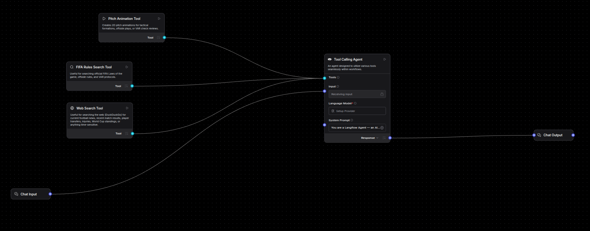

# MatchMind — AI World Cup Companion

An interactive AI-powered solution built for the **World Cup AI Challenge**. MatchMind helps fans, players, and match officials experience and understand football rules, VAR decisions, and tactical shifts through human-centered, explainable AI and **real-time pitch animations**.

## 🎥 Project Walkthrough Video

<video src="work_around_project.mp4" width="100%" controls></video>

*If the video player above does not load, you can download or view it directly here: [work_around_project.mp4](work_around_project.mp4)*

---

## 🏆 World Cup AI Challenge Alignment

MatchMind was designed specifically to tackle the key themes of the competition using the required open-source and enterprise technology stack:

*   **Docling Integration**: Used to perform layout-aware document ingestion of the official 230-page *FIFA Laws of the Game 2024/25*. By using **Docling's PDF extraction**, we preserve complex nested tables (e.g., misconduct guidelines, offside visual boundaries, card limits) that standard PDF loaders drop, ensuring a zero-hallucination knowledge base for RAG.
*   **Langflow Pipeline**: Integrated as a fully custom visual agent flow (`langflow/MatchMind RAG.json`). Langflow manages the visual document loading, recursive chunking, embedding, vector database interactions (ChromaDB), and agentic tool routing in a clean, observable visual canvas.
*   **IBM Granite Support**: MatchMind supports **IBM Granite** (`ibm/granite-13b-chat-v2`) via Watsonx as its core reasoning LLM to handle sports rule logic, semantic search evaluation, and pitch coordinate reasoning.
*   **Human-Centered Explainability**: Answers rule queries (like *"Why was that offside checked by VAR?"*) and generates structured play coordinate frames streamed to the frontend via SSE. The React client then renders **interactive pitch animation playbacks** showing players moving, ball trajectories, and offside lines to make complex decisions intuitive and accessible.

---

## Architecture Overview



```
Browser (React + Vite)
      │
      │  SSE streaming  /api/chat/stream
      ▼
FastAPI (main.py)
      │
      ├─── MODE A: Direct (default) ─────────────────────────────────────────
      │         rag.py  →  Agentic LLM loop (Groq llama-3.3-70b)
      │                        ├─ tool: search_fifa_rules  →  ChromaDB
      │                        ├─ tool: web_search         →  DuckDuckGo (free)
      │                        └─ tool: create_pitch_animation  →  SSE viz_data
      │
      └─── MODE B: Langflow ─────────────────────────────────────────────────
                Langflow (port 7860)
                    ├─ Dockling loader  →  PDF parsing (superior to PyMuPDF)
                    ├─ ChromaDB         →  vector store
                    ├─ Groq / OpenAI    →  LLM
                    └─ Agent tools      →  web search, retrieval
```

Switch between modes by setting/unsetting two env vars — no code changes.

---

## Mode A — Direct (default, no extra services)

### 1. Prerequisites

- Python 3.11+, Node 20+
- [Groq](https://console.groq.com) API key (free tier available)

### 2. Install

```bash
# Frontend
cd client && npm install && cd ..

# Server
cd server
python3 -m venv venv && source venv/bin/activate
pip install -r requirements.txt
```

### 3. Configure `.env`

```env
# ChromaDB
CHROMA_DB_PATH=/absolute/path/to/World_cup_ai/server/chroma_db
CHROMA_COLLECTION=fifa_rules

# CORS
CORS_ORIGINS=http://localhost:5173,http://localhost:8000

# LLM Provider: 'groq' | 'openai' | 'watsonx' | 'ollama'
LLM_PROVIDER=watsonx

# If using IBM Watsonx (Granite)
WATSONX_API_KEY=your_ibm_cloud_api_key
WATSONX_PROJECT_ID=your_watsonx_project_id
WATSONX_URL=https://us-south.ml.cloud.ibm.com
WATSONX_MODEL=ibm/granite-13b-chat-v2

# If using Groq (free tier)
GROQ_API_KEY=gsk_...
GROQ_MODEL=llama-3.3-70b-versatile

# Leave UNSET to use Direct mode
# LANGFLOW_URL=
# LANGFLOW_FLOW_ID=
```

### 4. Ingest the FIFA PDF

```bash
cd server
source venv/bin/activate
python ingest.py --pdf "Laws of the Game 2024_25.pdf"
```

Chunks the PDF, embeds with `all-MiniLM-L6-v2`, writes to `chroma_db/`.

### 5. Run

```bash
# Terminal 1 — server
cd server && source venv/bin/activate && python main.py

# Terminal 2 — client
cd client && npm run dev
```

Open [http://localhost:5173](http://localhost:5173).

---

## Mode B — Langflow (visual flow editor + Dockling)

Langflow lets you build and modify the RAG pipeline visually.  
**Dockling** replaces PyMuPDF for PDF parsing — better table extraction, layout understanding, and multi-format support.

### Why Langflow + Dockling?

| Feature | Direct (PyMuPDF) | Langflow + Dockling |
|---------|-----------------|---------------------|
| PDF parsing | Text blocks only | Layout-aware (tables, headings, captions) |
| Multi-format | PDF only | PDF, DOCX, PPTX, HTML, images |
| Visual editing | Code changes | Drag-and-drop UI |
| Chunking strategy | Hardcoded | Configurable per node |
| Observability | Logs | Built-in trace viewer |

---

### Option B1 — Docker (recommended, one command)

```bash
cp .env.example .env
# edit .env — set GROQ_API_KEY at minimum

docker compose up -d           # starts app + langflow
docker compose run --rm ingest # one-time PDF ingest
```

| Service | URL | Purpose |
|---------|-----|---------|
| `app` | http://localhost:8000 | MatchMind (FastAPI + React) |
| `langflow` | http://localhost:7860 | Visual flow editor |

Then follow **"Build the Langflow Flow"** below.

### Option B2 — Local Langflow install

```bash
pip install langflow
langflow run --host 0.0.0.0 --port 7860
```

---

### Build the Langflow Flow

#### Import the exported flow (fastest)

1. Open [http://localhost:7860](http://localhost:7860)
2. Click **"Upload Flow"**
3. Select `langflow/MatchMind RAG.json`
4. Done — the flow is ready, just add your API keys in the LLM node

---

#### Build manually (node by node)

Flow layout (left → right):

```
[Dockling Loader] → [Text Splitter] → [Chroma (ingest)]
                                             ↑
                                       [Embeddings]

[Chat Input] → [Agent] → [Chat Output]
                  ↑
           [search_fifa_rules tool]  ← Chroma (retrieval)
           [web_search tool]         ← DuckDuckGo
```

---

**Node 1 — Dockling Document Loader**

Search sidebar: `Dockling`

| Field | Value |
|-------|-------|
| Files | Upload `Laws of the Game 2024_25.pdf` |
| Export Format | `markdown` |
| Table Mode | `accurate` |

> Dockling correctly parses tables (penalty rules, card counts, dimensions) that PyMuPDF drops.

---

**Node 2 — Recursive Character Text Splitter**

| Field | Value |
|-------|-------|
| Chunk Size | `800` |
| Chunk Overlap | `100` |
| Separators | `\n\n`, `\n`, `. ` |

Connect: `Dockling → Splitter`

---

**Node 3 — HuggingFace Embeddings**

| Field | Value |
|-------|-------|
| Model Name | `sentence-transformers/all-MiniLM-L6-v2` |

*(No API key needed — runs locally)*

---

**Node 4 — Chroma (ingest + retrieval)**

| Field | Value |
|-------|-------|
| Collection Name | `fifa_rules_langflow` |
| Persist Directory | `/data/chroma_db` (Docker) or absolute local path |
| Search Type | `Similarity` |
| Number of Results | `5` |

Connect: `Splitter → Chroma`, `Embeddings → Chroma`

---

**Node 5 — search_fifa_rules Tool**

Add a second Chroma instance configured as a **Retriever Tool**:

| Field | Value |
|-------|-------|
| Name | `search_fifa_rules` |
| Description | `Search FIFA Laws of the Game for rules, VAR protocol, and definitions` |

Connect to Agent's tool input.

---

**Node 6 — DuckDuckGo Web Search Tool**

Search: `DuckDuckGo Search`

| Field | Value |
|-------|-------|
| Name | `web_search` |
| Max Results | `5` |

Connect to Agent's tool input.

---

**Node 7 — Agent (Tool-Calling LLM)**

| Field | Value |
|-------|-------|
| LLM | Groq → `llama-3.3-70b-versatile` |
| Tools | `search_fifa_rules`, `web_search` |
| System Message | see below |

System message:
```
You are MatchMind, an expert AI football companion for the FIFA World Cup.

Use search_fifa_rules to look up official FIFA Laws before answering rule questions.
Use web_search for current news, match results, transfers, or recent events not in the rules PDF.
For simple greetings or conversational messages, respond directly without using tools.

Always cite the FIFA Law number when explaining rules (e.g. "Law 11 – Offside").
```

Connect: `Chat Input → Agent → Chat Output`

---

### Activate Langflow mode in MatchMind

1. Get the Flow ID from the browser URL:
   `http://localhost:7860/flow/<YOUR-FLOW-ID>`

2. Add to `.env`:

```env
LANGFLOW_URL=http://localhost:7860
LANGFLOW_FLOW_ID=<paste-uuid-here>
# LANGFLOW_API_KEY=sk-...   # only if Langflow auth is enabled
```

3. Restart:

```bash
python main.py          # local
docker compose restart app  # Docker
```

MatchMind now forwards all queries to Langflow instead of running local RAG.

---

## Switching Between Modes

| Mode | `.env` |
|------|--------|
| Direct (Groq + local RAG + tools) | `LANGFLOW_URL=` *(unset or empty)* |
| Langflow | `LANGFLOW_URL=http://localhost:7860` + `LANGFLOW_FLOW_ID=<uuid>` |

No code changes — just edit `.env` and restart.

---

## Docker Stack Reference

```bash
docker compose up -d             # start all services
docker compose run --rm ingest   # ingest PDF into ChromaDB (run once)
docker compose logs -f app       # watch app logs
docker compose logs -f langflow  # watch Langflow logs
docker compose down              # stop everything
```

Services:

| Service | Port | Purpose |
|---------|------|---------|
| `ingest` | — | One-shot PDF → ChromaDB, then exits |
| `app` | 8000 | MatchMind FastAPI + React frontend |
| `langflow` | 7860 | Visual flow editor |

---

## Environment Variables

| Variable | Required | Default | Description |
|----------|----------|---------|-------------|
| `LLM_PROVIDER` | No | `openai` | `watsonx` / `groq` / `openai` / `ollama` / `openrouter` |
| `WATSONX_API_KEY` | Yes (Watsonx) | — | IBM Cloud API Key |
| `WATSONX_PROJECT_ID` | Yes (Watsonx) | — | Watsonx Project ID |
| `WATSONX_URL` | No | `https://us-south.ml.cloud.ibm.com` | IBM Cloud Watsonx instance URL |
| `WATSONX_MODEL` | No | `ibm/granite-13b-chat-v2` | IBM Granite chat model identifier |
| `GROQ_API_KEY` | Yes (Groq) | — | API key from console.groq.com |
| `GROQ_MODEL` | No | `llama-3.3-70b-versatile` | Groq model identifier |
| `CHROMA_DB_PATH` | No | `./server/chroma_db` | Absolute path to ChromaDB storage |
| `CHROMA_COLLECTION` | No | `fifa_rules` | Target ChromaDB collection name |
| `CORS_ORIGINS` | No | `http://localhost:5173` | Comma-separated allowed origins |
| `LANGFLOW_URL` | No | — | Set to enable Langflow backend mode |
| `LANGFLOW_FLOW_ID` | No | — | Custom flow UUID from Langflow UI |
| `LANGFLOW_API_KEY` | No | — | Optional x-api-key if Langflow auth is active |
| `OPENAI_API_KEY` | Yes (OpenAI) | — | OpenAI API key |

---

## Project Structure

```
World_cup_ai/
├── client/                  # React + TypeScript frontend (Vite)
│   ├── src/
│   │   ├── App.tsx          # Main layout + SSE client + agentic state
│   │   ├── components/
│   │   │   ├── PitchView.tsx    # Animated pitch canvas (portrait, 68×105)
│   │   │   └── ChatMessage.tsx  # Markdown renderer + tool status
│   │   ├── data/matches.ts  # 14 historical World Cup matches + events
│   │   └── types.ts
│   ├── package.json
│   └── vite.config.ts
├── server/                  # FastAPI backend (Python)
│   ├── main.py              # Routes + SSE streaming
│   ├── rag.py               # Agentic loop + 3 tools (Direct mode)
│   ├── ingest.py            # PDF → ChromaDB (PyMuPDF)
│   ├── requirements.txt
│   └── chroma_db/           # Vector store (git-ignored)
├── langflow/
│   ├── MatchMind RAG.json   # Exported flow — import via Langflow UI
│   ├── create_flow.py       # Script to auto-upload flow via API
│   └── README.md            # Langflow-specific setup
├── Dockerfile               # Multi-stage: client build → server image
├── docker-compose.yml       # app + langflow + ingest services
└── .env                     # Local config (never commit)
```

---

## Agentic Tools (Direct mode)

The LLM autonomously decides which tools to call per message:

| Tool | When called | Backend |
|------|-------------|---------|
| `search_fifa_rules` | Rule questions, VAR, Law citations | ChromaDB (local, no API key) |
| `web_search` | Recent news, results, transfers, injuries | DuckDuckGo (free, no API key) |
| `create_pitch_animation` | Any scenario where player positions help | LLM-generated JSON frames |

The frontend shows live tool status:
```
🔍 Searching FIFA rules for "offside law 11"…
✅ Found 5 relevant rule sections
📺 Generating pitch animation…
✅ Animation ready — 4 frames
```
